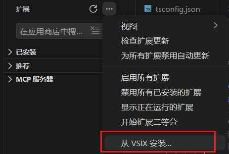

# SmartIME

面向中文开发者的 VS Code 输入法智能切换插件。

English README: [README.en.md](README.en.md)

## 功能概览

- 根据光标上下文自动切换中英文输入态。
- 识别字符串、单行注释、多行注释、文档注释、其他区域。
- Windows 下支持 Go 常驻 IME Worker 加速（优先使用，失败自动回退脚本命令）。
- 光标附近装饰器显示当前输入态（中/英）。
- 状态栏显示当前输入态与切换原因（切换时优先更新 UI，体感更快）。
- 支持正则规则（按光标左/右文本匹配）。
- 支持中文符号自动替换（默认含 Markdown 规则）。
- 支持 Vim NORMAL 模式优先英文（best effort）。

## 当前切换策略（最新版）

- 注释/字符串等中文场景：自动切到中文。
- 英文代码场景：自动切到英文。
- 在代码区手动按 Shift 切到中文后：
	- 不再按“停顿时间”自动切回英文。
	- 你可以自己按 Shift 切回英文。
	- 或者当你把光标移动到英文代码位置时，插件会自动切回英文。
- 右下角与光标装饰会尽快跟随系统输入态（含按 Shift 的手动切换）。
- 仅当 VS Code 窗口处于前台且你正在代码编辑区交互（光标移动/输入）时才执行检测。
- 切到 Typora、聊天面板、侧边栏或窗口失焦后会暂停检测；回到代码区后会快速恢复。

> 设计目标：符合程序员常见习惯，减少“我正在输入中文却被插件抢回英文”的打断感。

## 重要说明（输入法控制）

VS Code 扩展无法对所有输入法实现“统一直接控制”。
本项目通过可配置的系统命令与本机输入法工具集成。

请在设置中配置：

- smartInput.ime.getStateCommand
- smartInput.ime.switchToChineseCommand
- smartInput.ime.switchToEnglishCommand

若上述命令为空，插件仍可维护内部状态并更新状态栏/装饰器，
但不保证能真实切换系统输入法。

Windows 集成说明：

- 默认使用插件内置脚本在同一输入法中切换中/英状态。
- 若存在 `tools/ime-worker.exe`，会优先走 Go 常驻进程通道（更低延迟）。
- Go worker 不可用时自动回退到脚本命令，无需手动切换配置。
- 打包后会一并带上所需工具与脚本，不依赖当前窗口路径。
- 状态栏默认仅显示 `SmartIME 中/英`。

性能与实时性相关设置（常用）：

- `smartInput.evaluateDebounceMs`
	- 自动切换判定防抖毫秒数，越小越快。
- `smartInput.ime.pollingIntervalMs`
	- 轮询系统输入态间隔，建议 300ms 左右可兼顾实时性和开销。
- `smartInput.ime.liveSyncOnActivity`
	- 是否在光标/窗口活动时做状态同步。
- `smartInput.ime.liveSyncMinIntervalMs`
	- 活动同步最小间隔，越小越实时，越大越省资源。
- `smartInput.ime.liveSyncDebounceMs`
	- 活动同步防抖，降低高频抖动场景的额外开销。

## 快速开始

1. 在 VS Code 打开本项目。
2. 执行 `npm install`。
3. 执行 `npm run compile`。
4. 按 `F5` 启动 Extension Development Host。
5. 在命令面板执行 `Show Smart Input Pro Menu`。

也可以执行中文命令：`显示 SmartIME 菜单`。

## 安装教程

在扩展-右上角···-从vsix进行安装即可

## 开发流程

1. 先改清单：`package.json`
2. 再写实现：`src/extension.ts` + 业务模块
3. F5 调试，改动后在新窗口按 `Ctrl+R` 快速重载
4. 每次改动后先编译再验证交互

若修改了 Go Worker：

- 执行 `npm run build:ime-worker` 重新编译 `tools/ime-worker.exe`

## Windows 示例命令（可选）

当前默认（推荐）优先 Go Worker；脚本命令用于回退，按 `get / zh / en` 处理：

- getStateCommand: `powershell -NoProfile -NoLogo -NonInteractive -ExecutionPolicy Bypass -File <扩展目录>/tools/ime-mode.ps1 get`
- switchToChineseCommand: `powershell -NoProfile -NoLogo -NonInteractive -ExecutionPolicy Bypass -File <扩展目录>/tools/ime-mode.ps1 zh`
- switchToEnglishCommand: `powershell -NoProfile -NoLogo -NonInteractive -ExecutionPolicy Bypass -File <扩展目录>/tools/ime-mode.ps1 en`

